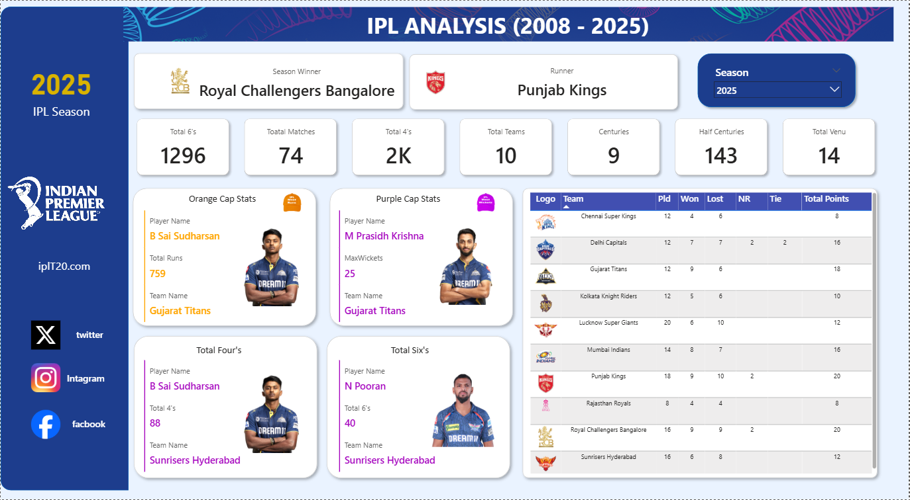

🏏 IPL Analysis Dashboard (2008–2025)

An interactive Power BI dashboard that analyzes historical data from the Indian Premier League (IPL) to uncover insights about team performance, player achievements, and match statistics across multiple seasons.

This project transforms raw IPL datasets into interactive visualizations and KPIs, helping users explore trends such as top run scorers, highest wicket takers, team standings, and match statistics.

📊 Dashboard Preview

🎯 Project Objectives

Analyze IPL performance trends from 2008–2025

Identify top-performing teams and players

Explore season-wise statistics

Create interactive and visually appealing dashboards

Demonstrate data analytics and visualization skills

📌 Key Insights & Features
🏆 Season Overview

Season winner and runner-up

Total matches played

Number of teams participating

📈 Match Statistics

Total 6s and 4s

Total matches played

Number of centuries scored

🧢 Player Performance

Orange Cap Holder (Highest Run Scorer)

Purple Cap Holder (Highest Wicket Taker)

Player with Most 4s

Player with Most 6s

📊 Team Performance Table

Matches Played

Wins

Losses

Points

Team rankings

🎛 Interactive Filters

Season Selector to explore different IPL seasons

Dynamic visuals that update based on filters

🛠 Tools & Technologies Used

Power BI – Dashboard development & visualization

Power Query – Data transformation

DAX (Data Analysis Expressions) – KPI calculations

Excel / CSV datasets – Data source

📂 Dataset Used

The dataset includes:

Match-level data

Ball-by-ball data

Team details

Player statistics

Typical tables used:

ipl_matches_data

ball_by_ball_data

players_data

teams_data

📊 Key KPIs Implemented

Examples of metrics calculated in the dashboard:

Total Matches

Total Sixes

Total Fours

Total Centuries

Orange Cap Runs

Purple Cap Wickets

Team Points Table

These KPIs were created using DAX measures inside Power BI.

📈 Skills Demonstrated

Data Cleaning & Transformation

Data Modeling

DAX Calculations

Interactive Dashboard Design

Sports Data Analytics

Data Storytelling

🚀 How to Use

Download the .pbix file from this repository.

Open it in Power BI Desktop.

Explore the dashboard using the Season Filter.

Interact with charts and tables to analyze IPL trends.

📌 Future Improvements

Add player comparison analysis

Create team performance trend charts

Add venue analysis

Build predictive analytics using Python or Power BI

👩‍💻 Author

Vaishnavi Gupta

Aspiring Data Analyst | Power BI | SQL | Python

🔗 GitHub: https://github.com/vaishnavig1020
🔗 LinkedIn: www.linkedin.com/in/vaishnavi-gupta-648885272

⭐ If you found this project useful, please star the repository!
